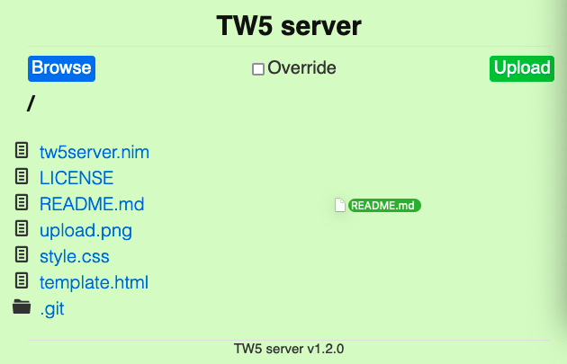

# tw5-server

A local server for TiddlyWiki5 that saves and backups wikis, inspired by [tw5-server.rb](https://gist.github.com/jimfoltz/ee791c1bdd30ce137bc23cce826096da).

tw5-server is written in Nim, provides features of:

- Server for TiddlyWiki5, as well as other files (e.g. images used in TW5 `[img[images/*.png]]`).
- Easy to save wiki via browsers.
- Upload images/files for using in TiddlyWiki5 via press button or drag-and-drop.
- Backup wiki in compressed format (.gz), to save disk space.
- Auto clean backups: keep the last one for previous months, keep all backups in current month.
- Offer binary executable for Linux, macos, Android and windows.

# Usage

Download binary executable for your operating system from [github release](https://github.com/hffqyd/tw5-server/releases), and run in your terminal (in Termux or other terminals if using Android).

```bash
Usage:
tw5server -a:localhost -p:8000 -d:dir -b:backup

-h this help
-c config file, json format, default tw5server.json
-a address, defautl "127.0.0.1"
-p port, default 8000
-d directory to serve, default `current dir`
-b backup directory, default `backup` in serve dir. `backup/` or `backup\\` for a backup path.
-l show log message
-m max size of uploaded file (MB), default 100

Backups auto-clean strategy:
Keep all backups in current month, keep only the newest one for previous months.
```

Then go to http://localhost:8000 (or other address:port specified in command) in your web browser, and click on your wiki html file.

# Upload example

1. Upload images/files (e.g. to an images directory) for use within TiddlyWiki5 (e.g. [img[images/some.png]]): Browse a file, check if to overwrite and submit, saving message will be on the right.


2. Upload images/files via drag-and-drop: Drag a file to tw5-server page (the border will show when draging), and drop.


