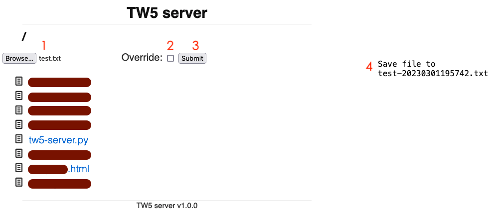

# tw5-server

A local server for TiddlyWiki5 that saves and backups wikis, inspired by [tw5-server.rb](https://gist.github.com/jimfoltz/ee791c1bdd30ce137bc23cce826096da).

tw5-server is written in Python, provides features of:

- Server for TiddlyWiki5, as well as other files (e.g. images used in TW5 `[img[images/*.png]]`).
- Easy to save wiki via browsers.
- Backup wiki in compress format (.gz), to save disk space.
- Auto clean backups: keep one newest per previous month, keep all backups in current month.
- Offer binary executable for Linux, macos and windows.

# Usage

```bash
# python script:
python tw5-server.py -p 8000 -d ./ -b backup_dir

# binary file:
tw5server -a:192.168.0.10 -p:8000 -d:./ -b:backup

-h usage help
-a address, defautl localhost
-p port, default 8000
-d directory to servering, default `current dir`
-b backup directory name, default `backup`
-l log saving messages to stdout

Backups auto-clean strategy:
Keep all backups in current month, keep only the newest one for previous months.
```

In Unix/Linux, just excute `./tw5-server.py` (with `chmod +x tw5-server.py`).

Then go to http://localhost:8000 (or other address:port specified in command) in your web browser, and click on your wiki html file.

# Plans

- [x] Upload images/files (e.g. to images directory) for use within TiddlyWiki5 (e.g. [img[images/some.png]]): Browse a file, check if override and submit, saving message will be on the right.
    
